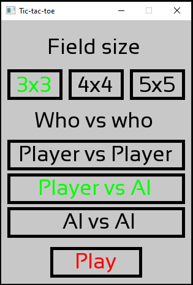
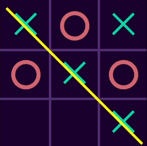
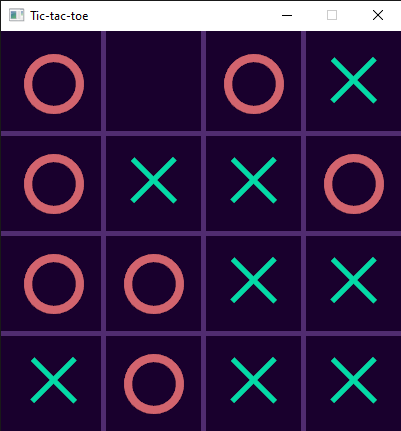

# Tic-tac-toe
Developed using C++ and SFML.
# Game options:
Field size: 3x3, 4x4, 5x5.
 
3 game modes: player vs player, player vs AI, AI vs AI.
# Screenshots:

  

    
  

  

    
  

  

    
  

